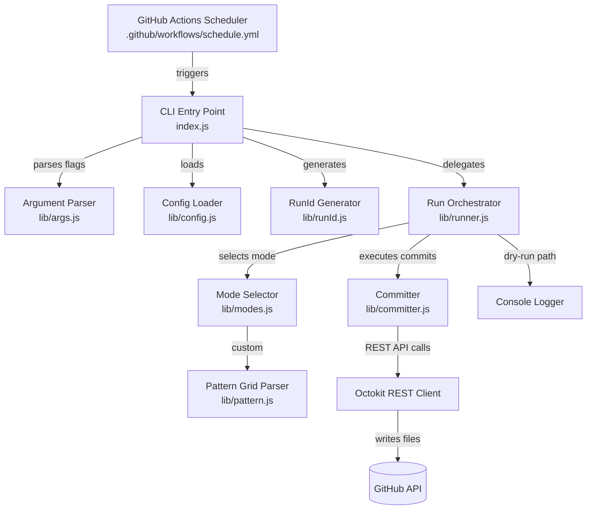

# Design Document: graph-keeper

## Overview

graph-keeper is a lightweight Node.js CLI tool that keeps a GitHub contribution graph green by making small, harmless commits to a dedicated repository on a configurable daily schedule. It runs entirely within GitHub Actions (free tier) — no server, no cron daemon, no local setup required after initial configuration.

The tool appends log entries to safe, isolated files (`.md`, `.json`, `.txt`) using the GitHub REST API via Octokit. It never touches real project code. Four commit frequency modes — `steady`, `burst`, `realistic`, and `custom` — let users control how natural the contribution graph looks.

Key design goals:
- Zero runtime infrastructure (GitHub Actions only)
- Strict repository isolation (never writes outside the dedicated repo)
- Configurable via a single `config.json` file
- Testable in isolation via `--dry-run`

---

## Architecture



The flow is strictly linear per run:

1. GitHub Actions triggers `index.js` via cron or `workflow_dispatch`
2. CLI parses flags, loads config, generates RunId
3. Runner determines commit count from the selected mode
4. Committer writes each file update and pushes commits via Octokit
5. In dry-run mode, all actions are logged to console instead

---

## Components and Interfaces

### CLI Entry Point (`index.js`)

Bootstraps the application. Parses CLI flags, loads config, generates RunId, and delegates to the Runner.

```js
// index.js
async function main(argv)
// Returns: void — exits with non-zero code on error
```

### Argument Parser (`lib/args.js`)

Parses `process.argv` and returns a structured options object.

```js
function parseArgs(argv)
// Returns: { dryRun: boolean, mode: string|null, patternFile: string|null }
// Throws: CLIError on unrecognised flags
```

### Config Loader (`lib/config.js`)

Reads and validates `config.json`.

```js
function loadConfig(filePath)
// Returns: Config object (see Data Models)
// Throws: ConfigError if file missing, unreadable, or schema-invalid
```

### RunId Generator (`lib/runId.js`)

Generates a 6-character random hex string.

```js
function generateRunId()
// Returns: string (e.g. "a3f9c1")
```

### Mode Selector (`lib/modes.js`)

Determines the number of commits for the current run based on the active mode.

```js
function resolveCommitCount(mode, commitsPerDay, patternGrid, today)
// Returns: number (0 or positive integer)
// Throws: ModeError on unknown mode
```

### Pattern Grid Parser (`lib/pattern.js`)

Loads and validates a `custom` mode pattern file.

```js
function loadPatternGrid(filePath)
// Returns: number[][] (52×7 grid of integers 0–4)
// Throws: PatternError if file missing, unreadable, or invalid structure
```

### Run Orchestrator (`lib/runner.js`)

Coordinates the full run: resolves commit count, selects messages, calls Committer (or dry-run logger).

```js
async function run(config, options, runId)
// Returns: void
```

### Committer (`lib/committer.js`)

Performs all file writes and commits via Octokit. Enforces file extension safety rules.

```js
async function commit(octokit, repo, owner, filePath, content, message)
// Returns: void
// Throws: CommitError on API failure or forbidden file extension
```

### Message Rotator (`lib/messages.js`)

Selects commit messages in a non-repeating sequence within a run.

```js
function createRotator(messages)
// Returns: { next(): string }
// Throws: if messages array has fewer than 2 entries
```

---

## Data Models

### Config (`config.json`)

```json
{
  "repo": "your-username/dev-activity",
  "mode": "realistic",
  "commitsPerDay": {
    "steady": 1,
    "burst": { "min": 3, "max": 8 },
    "realistic": { "min": 0, "max": 5, "weights": [10, 30, 25, 20, 10, 5] }
  },
  "targetFiles": [
    "changelog.md",
    "data/activity-log.json",
    "notes/daily.md"
  ],
  "commitMessages": [
    "chore: update activity log",
    "docs: daily notes sync",
    "chore: routine maintenance"
  ],
  "devNotes": [
    "Reviewed async patterns today.",
    "Explored new tooling options."
  ]
}
```

### Activity Log Entry (`data/activity-log.json`)

Each run appends one entry per commit:

```json
{
  "date": "2025-01-15",
  "time": "09:00:42Z",
  "runId": "a3f9c1",
  "mode": "realistic",
  "commitIndex": 0
}
```

### Pattern Grid

A 52×7 JSON array of integers 0–4. Week-major order (index 0 = first week of the year, index 0 within each week = Sunday).

```json
[
  [0, 1, 2, 3, 4, 3, 2],
  [1, 0, 0, 1, 2, 1, 0],
  ...
]
```

### CLI Options Object

```js
{
  dryRun: false,       // --dry-run flag
  mode: "burst",       // --mode <value>, null if not provided
  patternFile: null    // --pattern <file>, null if not provided
}
```

### RunId

A 6-character lowercase hexadecimal string generated via `crypto.randomBytes(3).toString('hex')`.

---

## Correctness Properties

*A property is a characteristic or behavior that should hold true across all valid executions of a system — essentially, a formal statement about what the system should do. Properties serve as the bridge between human-readable specifications and machine-verifiable correctness guarantees.*

### Property 1: Activity log entry contains all required fields

*For any* run configuration and generated RunId, every entry appended to `data/activity-log.json` must contain the fields `date`, `time`, `runId`, `mode`, and `commitIndex`, and the `runId` field must equal the RunId generated at the start of that run.

**Validates: Requirements 1.2, 5.2**

### Property 2: Dev-note is always from the configured pool

*For any* run configuration with a non-empty `devNotes` array, the note appended to `notes/daily.md` must be a member of the configured `devNotes` array.

**Validates: Requirements 1.3**

### Property 3: Only allowed file extensions are written

*For any* file path passed to the Committer, the Committer must reject paths with extensions `.js`, `.ts`, `.py`, `.env`, and files named `package.json`, and must accept only paths with extensions `.md`, `.json`, or `.txt`.

**Validates: Requirements 1.5, 2.2**

### Property 4: Token never written to file content

*For any* run where `GITHUB_TOKEN` is set in the environment, no file content written by the Committer during that run should contain the token value as a substring.

**Validates: Requirements 2.4**

### Property 5: Steady mode always produces exactly 1 commit

*For any* run configuration where the resolved mode is `steady`, `resolveCommitCount` must return exactly 1.

**Validates: Requirements 3.1**

### Property 6: Burst mode commit count is always in range [3, 8]

*For any* run configuration where the resolved mode is `burst`, `resolveCommitCount` must return a value in the inclusive range [3, 8].

**Validates: Requirements 3.2**

### Property 7: Realistic mode commit count is always in range [0, 5]

*For any* run configuration where the resolved mode is `realistic`, `resolveCommitCount` must return a value in the inclusive range [0, 5].

**Validates: Requirements 3.3**

### Property 8: Custom mode commit count matches grid intensity

*For any* valid Pattern_Grid and any day index within the grid, `resolveCommitCount` in `custom` mode must return exactly the integer value at the corresponding grid cell (0 means skip, 1–4 means that many commits).

**Validates: Requirements 3.4, 10.5, 10.6**

### Property 9: CLI --mode flag overrides config mode

*For any* config with a default mode and any valid `--mode` CLI flag value, the resolved mode for that run must equal the CLI flag value, not the config value.

**Validates: Requirements 3.6, 6.2**

### Property 10: All commit messages are from the configured pool

*For any* run configuration with a `commitMessages` array, every commit message selected during that run must be a member of the configured `commitMessages` array.

**Validates: Requirements 4.1**

### Property 11: No consecutive duplicate commit messages in a run

*For any* run producing two or more commits, no two consecutively selected commit messages within that run should be identical.

**Validates: Requirements 4.2, 4.3**

### Property 12: RunId is always exactly 6 hex characters

*For any* call to `generateRunId()`, the returned string must have length 6 and consist entirely of characters from `[0-9a-f]`.

**Validates: Requirements 5.1**

### Property 13: Unrecognised CLI flags cause non-zero exit

*For any* input argv array containing an unrecognised flag (not in `--dry-run`, `--mode`, `--pattern`), `parseArgs` must throw a `CLIError` (resulting in a non-zero exit code).

**Validates: Requirements 6.4**

### Property 14: Invalid or missing config causes non-zero exit

*For any* file path where `config.json` is absent, unreadable, or missing required fields (`repo`, `mode`, `commitsPerDay`, `targetFiles`, `commitMessages`, `devNotes`), `loadConfig` must throw a `ConfigError` (resulting in a non-zero exit code).

**Validates: Requirements 8.8, 8.2–8.7**

### Property 15: Pattern grid validation rejects invalid structures

*For any* JSON value that is not a 52-element array of 7-element arrays of integers in [0, 4], `loadPatternGrid` must throw a `PatternError`.

**Validates: Requirements 10.1, 10.3**

### Property 16: Pattern grid round-trip

*For any* valid Pattern_Grid (52×7, values 0–4), parsing the JSON serialisation of the grid must produce a value deeply equal to the original grid.

**Validates: Requirements 10.4**

---

## Error Handling

| Error Class | Trigger | Behaviour |
|---|---|---|
| `CLIError` | Unrecognised CLI flag | Log descriptive message, exit code 1 |
| `ConfigError` | Missing/malformed `config.json` | Log descriptive message, exit code 1 |
| `PatternError` | Missing/invalid pattern grid file | Log descriptive message, exit code 1 |
| `CommitError` | Octokit API failure | Log error with HTTP status, exit code 1 |
| `ModeError` | Unknown mode string | Log descriptive message, exit code 1 |

All errors are caught at the top level in `index.js` and result in a `process.exit(1)` call after logging to `console.error`. No stack traces are shown to the user in production; they are only logged when `DEBUG=1` is set.

The Committer performs a pre-flight check before any API call:
1. Verify file extension is in the allowed list
2. Verify the target repo matches `config.repo`
3. Verify `GITHUB_TOKEN` is present in the environment

If any check fails, the run aborts before making any API calls.

---

## Testing Strategy

### Dual Testing Approach

Both unit tests and property-based tests are required. They are complementary:
- Unit tests cover specific examples, integration points, and error conditions
- Property tests verify universal correctness across randomised inputs

### Property-Based Testing

Library: **fast-check** (npm package `fast-check`) — well-maintained, TypeScript-friendly, works in Node.js without additional setup.

Each property test runs a minimum of **100 iterations**.

Each test is tagged with a comment in the format:
`// Feature: graph-keeper, Property N: <property_text>`

Property test mapping:

| Property | Test target | fast-check arbitraries |
|---|---|---|
| P1: Activity log fields | `committer.buildLogEntry()` | `fc.record({ runId, mode, commitIndex })` |
| P2: Dev-note from pool | `runner.selectDevNote()` | `fc.array(fc.string(), { minLength: 2 })` |
| P3: File extension safety | `committer.isAllowedPath()` | `fc.string()` as file path |
| P4: Token not in content | `committer.buildContent()` | `fc.hexaString(6)` as token |
| P5: Steady = 1 commit | `modes.resolveCommitCount()` | `fc.constant('steady')` |
| P6: Burst in [3,8] | `modes.resolveCommitCount()` | `fc.constant('burst')` |
| P7: Realistic in [0,5] | `modes.resolveCommitCount()` | `fc.constant('realistic')` |
| P8: Custom = grid value | `modes.resolveCommitCount()` | `fc.array(fc.array(fc.integer(0,4), {minLength:7,maxLength:7}), {minLength:52,maxLength:52})` |
| P9: CLI overrides config | `args.parseArgs()` + mode resolution | `fc.constantFrom('steady','burst','realistic')` |
| P10: Messages from pool | `messages.createRotator()` | `fc.array(fc.string(), { minLength: 2 })` |
| P11: No consecutive dupes | `messages.createRotator()` | `fc.array(fc.string(), { minLength: 2 })` |
| P12: RunId format | `runId.generateRunId()` | (no arbitrary needed — pure output check) |
| P13: Bad flags exit | `args.parseArgs()` | `fc.string()` prefixed with `--` |
| P14: Bad config exits | `config.loadConfig()` | `fc.object()` with missing fields |
| P15: Invalid grid rejected | `pattern.loadPatternGrid()` | `fc.anything()` |
| P16: Grid round-trip | `pattern.loadPatternGrid()` + `JSON.stringify` | valid grid arbitrary |

### Unit Tests

Unit tests (using **Jest** or **Node.js built-in test runner**) cover:

- Dry-run mode makes zero Octokit calls (example: mock Octokit, assert no calls)
- GitHub Actions workflow file contains correct cron expression, `workflow_dispatch`, action versions, and env vars (example: parse YAML and assert fields)
- `.env.example` file exists and contains `GITHUB_TOKEN` and `COMMIT_MODE` (example: file read + string check)
- Config defaults: when no `--mode` flag is provided, the mode from `config.json` is used
- `--pattern` flag activates custom mode and loads the specified file
- Repo mismatch aborts the run (example: config.repo != env repo → CommitError)
- Token read from `GITHUB_TOKEN` env var, not from config or CLI

### Test File Structure

```
tests/
  unit/
    args.test.js
    config.test.js
    committer.test.js
    messages.test.js
    runner.test.js
    workflow.test.js
  property/
    args.property.test.js
    committer.property.test.js
    modes.property.test.js
    messages.property.test.js
    pattern.property.test.js
    runId.property.test.js
```
